# A Breakable Toy Experiment – Command-Line Accounting 

## About <a name = "about"></a>
The goal of this project is to create a simple implementation of the [ledged-cli](https://ledger-cli.org/)

Ledger is a powerful, double-entry accounting system that is accessed from the UNIX command-line. Ledger, begun in 2003, is written by John Wiegley and released under the BSD license. It has also inspired several ports to other languages.

Ledger is a command-line accounting tool that provides double-entry accounting based on a text journal. It provides no bells or whistles, and returns the user to the days before user interfaces were even a twinkling in their fathers’ CRTs.

## Requirements

### Must have 

[x] Support for the following commands: register, balance and print 

[x] Support flags: --sort, --price-db, --file  

[x] Expected output using sample ledger files 

### Nice to have 

[] Support all the commands and format from https://devhints.io/ledger

## Usage

You are about to see how to use this ledger cli implementation, which of course has technical debt and it must be refactored, but it was done with love, tears, and passion.


### **Register command**
The register command prints all the transactions or the transactions related to certain accounts in a ledger file, and show a running balance.

#### Aliases
- r
- reg

#### Flags
- -f, --file: Specifies the name of the ledger file you want to the register report.
    - Get only one parameter
- -a, --account: Specifies the account(s) that will be filtered in the register report.
    - Get different accounts separated by space.
- -s, --sort: Specifies the parameter in which the transactions will be sorted.
    - d: Sort the transactions by date.

#### Try it like this
```sh
sh ./my-ledger <command> [flags] # Must do it this way

sh ./my-ledger register -s d
sh ./my-ledger reg --file name.ledger
sh ./my-ledger r --acount Bank Asset Payable -s d
```

#### Output
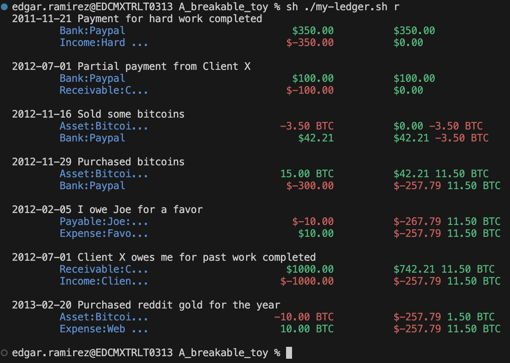

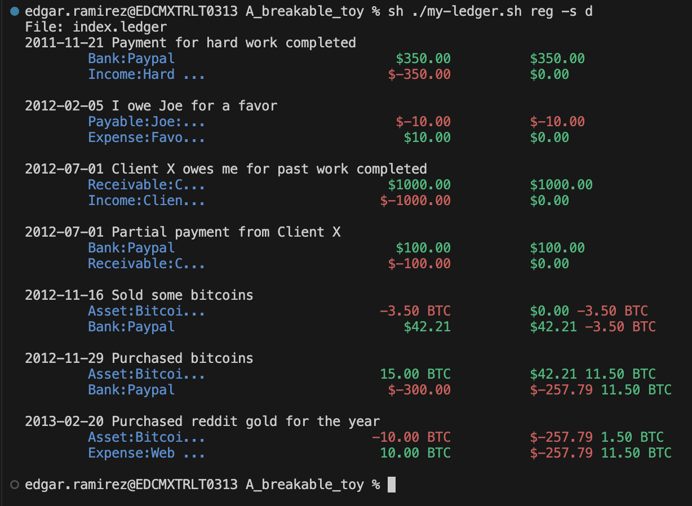

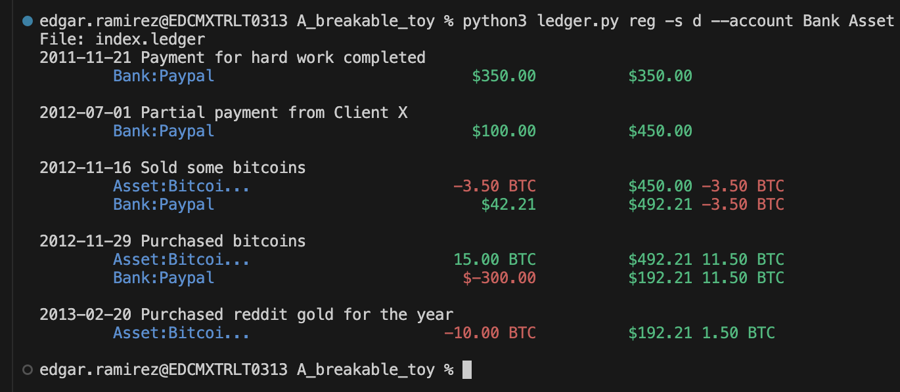

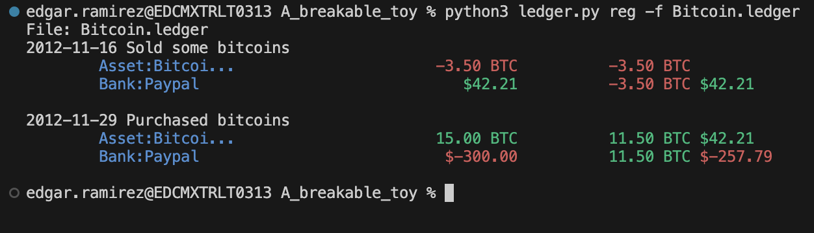


### **Balance command**
Show the balance of all the root accounts or the root accounts related to certain accounts in a ledger file.

#### Aliases
- b
- bal

#### Flags
- -f, --file: Specifies the name of the ledger file you want to the balance report.
    - Get only one parameter
- -a, --account: Specifies the account(s) that will be filtered in the balance report.
    - Get different accounts separated by space.
- --full: Shows the balance of the root accounts and its subaccounts.

#### Try it like this
```sh
sh ./my-ledger <command> [flags] # Must do it this way

sh ./my-ledger balance --full
sh ./my-ledger bal --file name.ledger
sh ./my-ledger b --acount Bank Asset Payable
```

#### Output
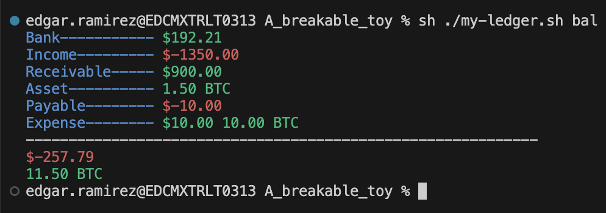

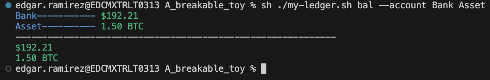

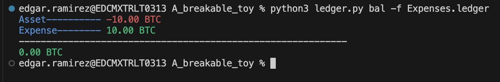

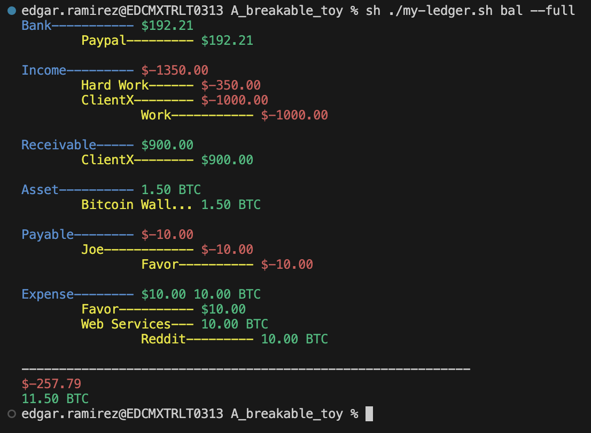

#### **Print command**

Print all the transactions of a ledger file in a with a readable format.

#### Aliases
- p

#### Flags
- -f, --file: Specifies the name of the ledger file you want to the print report.
    - Get only one parameter
- -a, --account: Specifies the account(s) that will be filtered in the print report.
    - Get different accounts separated by space.
- -s, --sort: Specifies the parameter in which the transactions will be sorted.
    - d: Sort the transactions by date.

#### Try it like this
```sh
sh ./my-ledger <command> [flags] # Must do it this way

sh ./my-ledger print -s d
sh ./my-ledger p --file name.ledger
sh ./my-ledger print --acount Bank Asset Payable -s d
```

#### Output
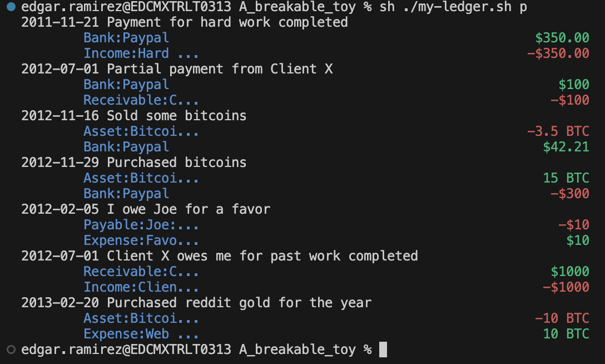

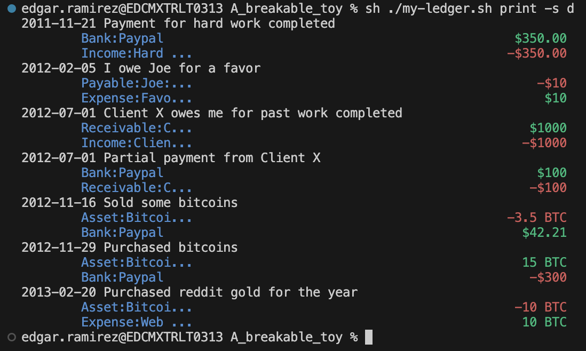

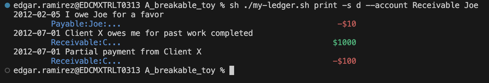

